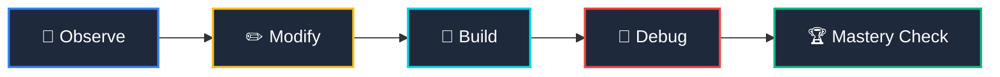

# 🛤️ BehindTheSite - Master Backend Learning Platform

> A mastery-based, zero-compression backend curriculum for absolute beginners. Built with the exact side-by-side micro-lesson UX of DataCamp, backed by interactive python compilations, visual folder sandboxes, and secure Supabase cloud progress synchronization.

---

## ⚡ The Philosophy: Deep Backend Mastery
Most online tutorials compress backend concepts into trivial videos. **BehindTheSite** rejects fast content compression in favor of deep, granular, hands-on learning. 

Every single core concept is taught through isolated **2-to-5 minute micro-lessons** that repeatedly guide the student through a strict five-stage pipeline:



---

## 🚀 Key Features

### 💻 Clutter-Free DataCamp Split-Screen UI
No visual bloat or distraction. The workspace is built on a precise split layout:
- **Left Column (40%)**: Clear conceptual text alongside a distinct, bordered **Instructions Checklist Box** for active targets.
- **Right Column (60%)**: A clean coding editor supporting monospaced line-numbers (`main.py`), interactive quiz selector cards, or folder matching sandboxes.
- **Console Pane**: A monospaced command console returning live compiler prints, descriptive error logs, and successful check assertions.
- **Syllabus Overlay Drawer**: A sliding side drawer listing all chapters and lesson completion marks (`✓` / `○`).

### 📁 Architectural Match Sandbox
Backend is not just code; it's folders and structure. BehindTheSite includes an interactive matching sandbox requiring students to physically drag/match backend modules (routes, models, controllers, env secrets) to their correct directory tree nodes.

### 🛡️ Secure Decoupled Supabase Flow
All student progress, streaks, achievements, and active lesson markers sync in real-time to a secure PostgreSQL database. The UI is completely decoupled from the data layer (`UI ➔ React State ➔ Service ➔ Supabase Auth/DB`), allowing you to scale or swap backend systems with ease.

---

## 🗺️ Curriculum Overview

BehindTheSite is engineered around **15 deep backend chapters** designed to train complete beginners into production-ready developers:

* **Chapter 1**: The Internet Protocol (DNS, TCP/IP, Request/Response cycles)
* **Chapter 2**: HTTP Protocol (Methods, Headers, Status Codes, Request Anatomy)
* **Chapter 3**: Core APIs (Endpoints, JSON payloads, Serialization)
* **Chapter 4**: Framework Foundations (Routers, Controllers, Requests/Responses)
* **Chapter 5**: Python Syntax Mastery (Functions, Loops, Dicts, Custom Classes)
* **Chapter 6**: Database Architecture (Tables, RDBMS vs NoSQL, SQL schemas)
* **Chapter 7**: Object-Relational Mapping (Why ORMs exist, Models, Schemas)
* **Chapter 8**: Modular Architecture (Folder Trees, Models/Views/Controllers)
* **Chapter 9**: Production Connections (SQLAlchemy, PostgreSQL, Migrations)
* **Chapter 10**: AI Service Integrations (Gemini API, Secure tokens)
* **Chapter 11**: Intermediate Python (OOP, Async, Middlewares)
* **Chapter 12**: Secure Endpoints (CORS, Rate Limiters, Sanitization)
* **Chapter 13**: Student Authentication (JWTs, Cookies, Passwords)
* **Chapter 14**: API Engineering Project (Building the Domain Matcher)
* **Chapter 15**: Graduation Exam Capstone (Building the entire API from scratch)

---

## 🛠️ Tech Stack & Architecture

- **Frontend Core**: React 19, Vite (Fast Hot Module Replacement)
- **Styling**: Vanilla CSS utilizing curated harmonious variables (`index.css`)
- **Backend/Database**: Supabase Auth, PostgreSQL Cloud Database
- **Execution Simulator**: In-browser Python interpreter emulator with assert-based schema checks

---

## ⚙️ Installation & Setup

### 1. Clone & Install Dependencies
```bash
git clone https://github.com/[YOUR-USERNAME]/BehindTheSite.git
cd BehindTheSite
npm install
```

### 2. Configure Environment variables
Create a `.env` file in the root directory:
```env
VITE_SUPABASE_URL=https://[YOUR-PROJECT-ID].supabase.co
VITE_SUPABASE_ANON_KEY=[YOUR-ANON-PUBLIC-KEY]
```

### 3. Initialize your PostgreSQL Database
Execute the following schema in your **Supabase SQL Editor** to establish the profiles table, attach Row Level Security (RLS), and configure auto-seeding triggers:
```sql
-- Create student profiles
create table public.profiles (
  id uuid references auth.users on delete cascade primary key,
  username text unique,
  xp integer default 0,
  streak integer default 0,
  last_activity_date date,
  completed_lessons text[] default '{}',
  achievements text[] default '{}',
  active_lesson_id text default '1.1',
  created_at timestamp with time zone default timezone('utc'::text, now()) not null,
  updated_at timestamp with time zone default timezone('utc'::text, now()) not null
);

-- Row Level Security
alter table public.profiles enable row level security;

create policy "Allow users to read their own progress profile"
  on public.profiles for select
  using (auth.uid() = id);

create policy "Allow users to update their own progress profile"
  on public.profiles for update
  using (auth.uid() = id);

-- Auto-seed user trigger
create or replace function public.handle_new_user()
returns trigger as $$
begin
  insert into public.profiles (id, username, xp, streak, active_lesson_id)
  values (new.id, split_part(new.email, '@', 1), 0, 0, '1.1');
  return new;
end;
$$ language plpgsql security definer;

create trigger on_auth_user_created
  after insert on auth.users
  for each row execute procedure public.handle_new_user();
```

### 4. Launch Local Dev Server
```bash
npm run dev
```
Open [http://localhost:5173/](http://localhost:5173/) on your browser to start your backend mastery journey!
