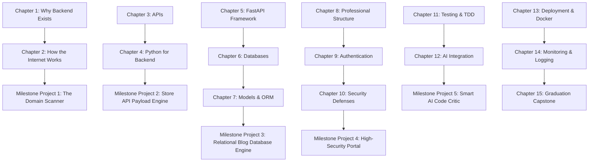

# BehindTheSite: Complete Master Curriculum Map
> *"The curriculum is the product. The website is only the delivery system."*

This document serves as the absolute source of truth for the BehindTheSite backend development syllabus. It breaks down every major backend engineering block into granular micro-lessons, structured around the zero-fluff **Observe ➔ Modify ➔ Build ➔ Debug ➔ Mastery Check** pipeline.

---

## 📈 Learning Progression Principles
1. **Single-Concept Focus**: Each micro-lesson teaches exactly *one* key concept and has exactly *one* actionable exercise objective, taking 2–5 minutes.
2. **Zero Assumptions**: We start from absolute zero prior technical or computer science background.
3. **Mandatory Progression Pipeline**:
   * **Observe**: Read/run clean existing code and trace request flows visually.
   * **Modify**: Tweak parameters, endpoints, or variables in existing code to see immediate output changes.
   * **Build**: Construct a specific backend component from scratch using guided starting scaffolding.
   * **Debug**: Locate, trace, and patch logical or syntax issues in broken scripts.
   * **Mastery Check**: Solve a real-world problem completely independently with strict test validations.
4. **Structural Checkpoints**:
   * Each **Section** ends with a conceptual checkpoint quiz.
   * Each **Chapter** ends with a hands-on **Mini Project** and a **Chapter Exam**.
   * Every **2-3 Chapters** concludes with a **Milestone Project** integrating all previous concepts.
   * The entire curriculum builds towards the **Final Graduation Capstone**.

---

## 🗺️ Master Roadmap Index

---

## 📚 Chapter Syllabi

### Chapter 1: Why Backend Exists
*Discover what happens behind the curtains of the web. Learn the absolute 'Why' before the 'How'.*

#### Section A: The Client-Server Model
* **Lesson 1.1 (Observe)**: Tour the split: The Browser and the Remote Server.
* **Lesson 1.2 (Modify)**: Tweak a static HTML element and watch it render instantly.
* **Lesson 1.3 (Build)**: Map a custom text payload to be sent from the browser.
* **Lesson 1.4 (Debug)**: Trace a disconnected cable error (Client cannot find Server).
* **Lesson 1.5 (Mastery)**: Define which user actions require a server connection.

#### Section B: Static vs Dynamic Content
* **Lesson 1.6 (Observe)**: Compare identical digital signs vs dynamic feeds.
* **Lesson 1.7 (Modify)**: Modify a server script's variables to alter welcome text dynamically.
* **Lesson 1.8 (Build)**: Build a simple Python greetings generator for different users.
* **Lesson 1.9 (Debug)**: Fix a broken string concatenation crashing the greet logic.
* **Lesson 1.10 (Mastery)**: Create an automated condition verifying Premium vs Standard greetings.

#### Section C: Chapter Assessment & Practice
* **Chapter Checkpoint**: Chapter 1 Conceptual Quiz.
* **Mini Project 1**: "The Digital Billboard" – Designing a script that shifts layout content based on temporal hours.
* **Chapter 1 Exam**: Dynamic payload evaluation check.

---

### Chapter 2: How The Internet Works
*Master the invisible pipeline: DNS, IP addresses, HTTP requests, and status flags.*

#### Section A: IP Addresses & DNS
* **Lesson 2.1 (Observe)**: Inspect actual IP addresses (numbers vs human words).
* **Lesson 2.2 (Modify)**: Tweak a local DNS mapping file to point domains to custom IPs.
* **Lesson 2.3 (Build)**: Map a domain key to an IP value inside a Python lookup helper.
* **Lesson 2.4 (Debug)**: Fix a misspelled domain key search throwing KeyErrors.
* **Lesson 2.5 (Mastery)**: Resolve domain routing addresses securely.

#### Section B: HTTP Request Structure
* **Lesson 2.6 (Observe)**: Inspect headers, query fields, and request bodies.
* **Lesson 2.7 (Modify)**: Change the HTTP `Content-Type` header parameter.
* **Lesson 2.8 (Build)**: Package user email and status into an HTTP payload body.
* **Lesson 2.9 (Debug)**: Correct mismatched quotation tags breaking request metadata.
* **Lesson 2.10 (Mastery)**: Formulate a validated HTTP request payload.

#### Section C: HTTP Status Codes
* **Lesson 2.11 (Observe)**: Observe status groups: 2xx success, 4xx client errors, 5xx server issues.
* **Lesson 2.12 (Modify)**: Alter a server check to return 401 Unauthorized for empty passwords.
* **Lesson 2.13 (Build)**: Write an status-code dispatcher returning correct HTTP responses.
* **Lesson 2.14 (Debug)**: Trace a logic bug returning 200 OK for failed login records.
* **Lesson 2.15 (Mastery)**: Construct full status mappings for API handlers.

#### Section D: Chapter Assessment & Practice
* **Chapter Checkpoint**: DNS & Request Lifecycle Conceptual Quiz.
* **Mini Project 2**: "The Domain Scanner" – A diagnostic script checking HTTP availability status across servers.
* **Chapter 2 Exam**: Complete request-response code challenge.
* **🏆 Milestone Project 1**: "The Internet Pipeline Dashboard" - Visual trace simulation linking DNS maps, status logs, and HTTP payload payloads.

---

### Chapter 3: APIs (Application Programming Interfaces)
*Build endpoints, process query parameters, and handle HTTP methods professionally.*

#### Section A: Why APIs Exist
* **Lesson 3.1 (Observe)**: Trace one unified backend responding to iOS and Web apps.
* **Lesson 3.2 (Modify)**: Alter a mock JSON endpoint response structure.
* **Lesson 3.3 (Build)**: Build a simple Python dict matching standardized API formats.
* **Lesson 3.4 (Debug)**: Trace a syntax error in nested JSON arrays.
* **Lesson 3.5 (Mastery)**: Design a unified data blueprint for product catalog cards.

#### Section B: Endpoint Routes
* **Lesson 3.6 (Observe)**: Inspect base URL structures: `/api/v1/users` vs `/api/v1/orders`.
* **Lesson 3.7 (Modify)**: Change a route path parameter.
* **Lesson 3.8 (Build)**: Write clean path string endpoints.
* **Lesson 3.9 (Debug)**: Fix double slash collisions in route registrations.
* **Lesson 3.10 (Mastery)**: Implement nested path routes for user-associated profiles.

#### Section C: HTTP Methods (GET, POST, PUT, DELETE)
* **Lesson 3.11 (Observe)**: Map verbs to operations: GET (Read), POST (Create), PUT (Update), DELETE.
* **Lesson 3.12 (Modify)**: Switch a route handler method.
* **Lesson 3.13 (Build)**: Write Python function blocks managing GET and POST options.
* **Lesson 3.14 (Debug)**: Resolve a method overlap returning PUT payload validations for GET triggers.
* **Lesson 3.15 (Mastery)**: Build standard REST endpoint controllers for product inventories.

#### Section D: Request Parameters
* **Lesson 3.16 (Observe)**: Contrast Query parameters (`?limit=10`) vs Path parameters (`/users/4`).
* **Lesson 3.17 (Modify)**: Edit path routing keys.
* **Lesson 3.18 (Build)**: Write code collecting query flags to filter user lists.
* **Lesson 3.19 (Debug)**: Correct index errors when missing optional parameter values.
* **Lesson 3.20 (Mastery)**: Build complex page pagination routes.

#### Section E: Chapter Assessment & Practice
* **Chapter Checkpoint**: Conceptual REST API design quiz.
* **Mini Project 3**: "The Library API Catalog" – Creating endpoints registering books, parsing authors, and checking tags.
* **Chapter 3 Exam**: Full REST handler assessment.

---

### Chapter 4: Python Foundations For Backend
*Master loops, lists, dictionaries, classes, and error handling designed for API operations.*

#### Section A: Dicts & Lists (API data cousins)
* **Lesson 4.1 (Observe)**: Trace mapping Python structures to standard JSON.
* **Lesson 4.2 (Modify)**: Edit dictionary keys and nested lists.
* **Lesson 4.3 (Build)**: Build dictionary records representing active student logs.
* **Lesson 4.4 (Debug)**: Resolve IndexErrors and KeyErrors in deep arrays.
* **Lesson 4.5 (Mastery)**: Construct formatted user profile matrices dynamically.

#### Section B: Advanced Functions & Decorators
* **Lesson 4.6 (Observe)**: Observe how decorators (`@`) modify function operations.
* **Lesson 4.7 (Modify)**: Alter a decorator function to double output values.
* **Lesson 4.8 (Build)**: Construct a logging decorator capturing execution times.
* **Lesson 4.9 (Debug)**: Resolve arguments collisions in decorated scopes.
* **Lesson 4.10 (Mastery)**: Build a route-guard decorator verifying user parameters.

#### Section C: Python Classes
* **Lesson 4.11 (Observe)**: Trace blueprints (Classes) vs instances (Objects).
* **Lesson 4.12 (Modify)**: Add dynamic properties to an existing User model class.
* **Lesson 4.13 (Build)**: Write a class mapping HTTP requests dynamically.
* **Lesson 4.14 (Debug)**: Resolve issues caused by missing `self` parameters.
* **Lesson 4.15 (Mastery)**: Construct clean object-oriented controllers.

#### Section D: Chapter Assessment & Practice
* **Chapter Checkpoint**: Python backend syntax quiz.
* **Mini Project 4**: "The CSV Parser" – Constructing a module mapping CSV rows into Python dictionaries.
* **🏆 Milestone Project 2**: "Payload Factory Engine" - An automated script taking raw parameters, validating classes, and outputting JSON profiles.

---

### Chapter 5: FastAPI Framework
*Build high-performance, validated APIs using modern Python FastAPI.*

#### Section A: Routes & App Creation
* **Lesson 5.1 (Observe)**: Trace FastAPI imports, app instantiations, and server mounting.
* **Lesson 5.2 (Modify)**: Alter standard paths and custom messages.
* **Lesson 5.3 (Build)**: Initialize a FastAPI base system with health check pages.
* **Lesson 5.4 (Debug)**: Resolve import pathway errors and port conflicts.
* **Lesson 5.5 (Mastery)**: Mount complex routes into separate FastAPI apps.

#### Section B: Request Schemas (Pydantic)
* **Lesson 5.6 (Observe)**: Review strict model schemas and input validation checks.
* **Lesson 5.7 (Modify)**: Add email and password format constraints to standard schemas.
* **Lesson 5.8 (Build)**: Construct Pydantic schemas validating user account parameters.
* **Lesson 5.9 (Debug)**: Patch validation errors caused by wrong dictionary imports.
* **Lesson 5.10 (Mastery)**: Build verified endpoints filtering user sign-up details.

#### Section C: Dependency Injection
* **Lesson 5.11 (Observe)**: Observe the `Depends` parameter injecting database services.
* **Lesson 5.12 (Modify)**: Modify mock dependencies returning verified credentials.
* **Lesson 5.13 (Build)**: Write code injecting log configs dynamically into endpoints.
* **Lesson 5.14 (Debug)**: Fix infinite dependency loops.
* **Lesson 5.15 (Mastery)**: Write custom auth guards using FastAPI dependencies.

#### Section D: Chapter Assessment & Practice
* **Chapter Checkpoint**: FastAPI patterns and schemas quiz.
* **Mini Project 5**: "Task Manager API" – Design a CRUD API managing todo elements, dates, and priorities.
* **Chapter 5 Exam**: Build and launch checked routes independently.

---

### Chapter 6: Databases & Relational SQL
*Store information permanently using columns, rows, primary keys, and relationships.*

#### Section A: Relational Structures & Tables
* **Lesson 6.1 (Observe)**: Tour tabular designs (primary vs foreign keys).
* **Lesson 6.2 (Modify)**: Alter database schemas to add nullable constraints.
* **Lesson 6.3 (Build)**: Construct SQL CREATE TABLE commands matching backend models.
* **Lesson 6.4 (Debug)**: Resolve constraint violations when inserting null variables.
* **Lesson 6.5 (Mastery)**: Design strict databases mapping users, profiles, and order tables.

#### Section B: SQL SELECT Queries
* **Lesson 6.6 (Observe)**: Review standard SQL: SELECT, WHERE, and LIMIT.
* **Lesson 6.7 (Modify)**: Edit filters to query specific active accounts.
* **Lesson 6.8 (Build)**: Write SQL commands to collect products below target prices.
* **Lesson 6.9 (Debug)**: Resolve syntax exceptions in WHERE clauses.
* **Lesson 6.10 (Mastery)**: Query complex relational data records.

#### Section C: SQL JOINs & Connections
* **Lesson 6.11 (Observe)**: Visualizing INNER JOIN, LEFT JOIN, and table unions.
* **Lesson 6.12 (Modify)**: Edit join queries linking comments to corresponding users.
* **Lesson 6.13 (Build)**: Write commands retrieving user accounts with active payments.
* **Lesson 6.14 (Debug)**: Resolve table name ambiguities in joined conditions.
* **Lesson 6.15 (Mastery)**: Build comprehensive SQL join queries for analytical panels.

#### Section D: Chapter Assessment & Practice
* **Chapter Checkpoint**: SQL architecture quiz.
* **Mini Project 6**: "School Grade Archive" – Designing a relational database structure and querying average score cards.
* **Chapter 6 Exam**: Complete database schema and query assessment.

---

### Chapter 7: Models & ORM (Object Relational Mappers)
*Bridge the gap between Python classes and relational database tables using SQLAlchemy.*

#### Section A: ORM Basics & Models
* **Lesson 7.1 (Observe)**: Trace Python models connecting directly to SQL columns.
* **Lesson 7.2 (Modify)**: Alter Model columns by mapping new integer rows.
* **Lesson 7.3 (Build)**: Construct SQLAlchemy user schemas.
* **Lesson 7.4 (Debug)**: Fix broken attribute mapping definitions.
* **Lesson 7.5 (Mastery)**: Build relational structures associating accounts with cards.

#### Section B: DB Sessions & CRUD Operations
* **Lesson 7.6 (Observe)**: Tour session states: opening, committing, and closing transactions.
* **Lesson 7.7 (Modify)**: Tweak Python queries filtering account details.
* **Lesson 7.8 (Build)**: Write DB engine functions inserting profiles.
* **Lesson 7.9 (Debug)**: Resolve session lock exceptions.
* **Lesson 7.10 (Mastery)**: Build full user login DB validation functions.

#### Section C: Chapter Assessment & Practice
* **Chapter Checkpoint**: SQLAlchemy and session quiz.
* **Mini Project 7**: "E-Commerce Database Engine" – Building ORM models managing stocks and customers.
* **🏆 Milestone Project 3**: "The Unified SQL Bridge" - Dynamic FastAPI routes directly inserting and querying data fields through an active local SQLite engine.

---

### Chapter 8: Professional Project Structure
*Segregate routes, controllers, services, repositories, schemas, models, and configs.*

#### Section A: Layer Separation
* **Lesson 8.1 (Observe)**: Tour real modular project templates.
* **Lesson 8.2 (Modify)**: Re-map importing routes.
* **Lesson 8.3 (Build)**: Scaffold modular folder pathways.
* **Lesson 8.4 (Debug)**: Fix absolute and relative python import circular paths.
* **Lesson 8.5 (Mastery)**: Design clean layer architectures segregating user accounts.

#### Section B: Services & Repositories
* **Lesson 8.6 (Observe)**: Inspect why Repositories talk to DBs and Services manage logic.
* **Lesson 8.7 (Modify)**: Tweak subscription checks inside payment services.
* **Lesson 8.8 (Build)**: Build independent repository layers collecting user logs.
* **Lesson 8.9 (Debug)**: Trace errors passing raw HTTP objects to repositories.
* **Lesson 8.10 (Mastery)**: Write custom auth repositories securely.

#### Section C: Chapter Assessment & Practice
* **Chapter Checkpoint**: Architecture layout quiz.
* **Mini Project 8**: "The Modular Blog Application" – Scaffold and separate routes, database services, and models for a simple blog API.
* **Chapter 8 Exam**: Modular project import re-architect challenge.

---

### Chapter 9: User Authentication
*Secure endpoints with password hashing, login validations, and JSON Web Tokens (JWT).*

#### Section A: Password Hashing
* **Lesson 9.1 (Observe)**: Tour irreversible cryptographic hashes (bcrypt/argon2).
* **Lesson 9.2 (Modify)**: Change hashing iteration salts.
* **Lesson 9.3 (Build)**: Write helper scripts comparing hashed profiles.
* **Lesson 9.4 (Debug)**: Trace errors comparing string passwords directly to bytes arrays.
* **Lesson 9.5 (Mastery)**: Secure database credentials with verified hashes.

#### Section B: JWT (JSON Web Tokens)
* **Lesson 9.6 (Observe)**: Inspect JWT layouts: Header, Payload, Signature.
* **Lesson 9.7 (Modify)**: Tweak signature expiration timestamps.
* **Lesson 9.8 (Build)**: Construct token validation middleware.
* **Lesson 9.9 (Debug)**: Resolve expired validation parameters.
* **Lesson 9.10 (Mastery)**: Build comprehensive login systems returning JWT access tokens.

#### Section C: Chapter Assessment & Practice
* **Chapter Checkpoint**: Auth and token flow quiz.
* **Mini Project 9**: "Secure Gateway API" – FastAPI platform verifying profiles, managing login, and locking routes.
* **Chapter 9 Exam**: Credentials and access token check.

---

### Chapter 10: Security Defenses
*Defend systems against SQL injection, cross-origin restrictions (CORS), and credential exposure.*

#### Section A: SQL Injections
* **Lesson 10.1 (Observe)**: Inspect dangerous raw string input concatenations.
* **Lesson 10.2 (Modify)**: Convert raw strings into SQL parameterized variables.
* **Lesson 10.3 (Build)**: Write secure, pre-compiled queries.
* **Lesson 10.4 (Debug)**: Audit code to clean vulnerable parameters.
* **Lesson 10.5 (Mastery)**: Guarantee absolute login defenses against bypass scripts.

#### Section B: CORS Mappings
* **Lesson 10.2 (Observe)**: Tour browser cross-origin blocked parameters.
* **Lesson 10.7 (Modify)**: Tweak FastAPI CORS middleware settings.
* **Lesson 10.8 (Build)**: Configure access to allow specific dev ports.
* **Lesson 10.9 (Debug)**: Resolve browser blocking errors on production ports.
* **Lesson 10.10 (Mastery)**: Deploy CORS whitelist mappings.

#### Section C: Chapter Assessment & Practice
* **Chapter Checkpoint**: Security guidelines quiz.
* **Mini Project 10**: "Vulnerability Scanner" – Run static checks finding insecure database routes.
* **🏆 Milestone Project 4**: "The Fortress Gateway" - Deploying fully verified, modular endpoints incorporating strict Pydantic schemas, bcrypt salts, JWT tokens, and CORS filters.

---

### Chapter 11: Testing & TDD
*Write robust automated checks ensuring API operations remain stable.*

#### Section A: Pytest & Mocks
* **Lesson 11.1 (Observe)**: Trace Pytest assertions running in milliseconds.
* **Lesson 11.2 (Modify)**: Edit assertion test criteria.
* **Lesson 11.3 (Build)**: Write test routines validating database CRUD logs.
* **Lesson 11.4 (Debug)**: Resolve test teardown errors locking local SQLite DB files.
* **Lesson 11.5 (Mastery)**: Write full TDD tests for active order routes.

#### Section B: Integration Tests
* **Lesson 11.6 (Observe)**: Trace requests traveling through routes, services, and test DBs.
* **Lesson 11.7 (Modify)**: Edit test profiles.
* **Lesson 11.8 (Build)**: Write dynamic endpoint tests.
* **Lesson 11.9 (Debug)**: Resolve credential exceptions in test contexts.
* **Lesson 11.10 (Mastery)**: Design comprehensive endpoint checking suites.

#### Section C: Chapter Assessment & Practice
* **Chapter Checkpoint**: Testing principles quiz.
* **Mini Project 11**: "The Route Inspector" – Build pytests validating return statuses for all CRUD actions.
* **Chapter 11 Exam**: Complete TDD checking challenge.

---

### Chapter 12: AI Integration
*Connect backend engines safely to AI APIs, parsing outputs and securing secret keys.*

#### Section A: Secure API Integration
* **Lesson 12.1 (Observe)**: Review where variables live (secrets map inside `.env`).
* **Lesson 12.2 (Modify)**: Change prompt structure queries sent to Gemini.
* **Lesson 12.3 (Build)**: Write controllers communicating with model APIs.
* **Lesson 12.4 (Debug)**: Tracing errors caused by empty API environment parameters.
* **Lesson 12.5 (Mastery)**: Implement private keys wrappers.

#### Section B: Response Processing
* **Lesson 12.6 (Observe)**: Trace unstructured JSON text outputs from AI queries.
* **Lesson 12.7 (Modify)**: Change system prompts requesting strictly structured JSON.
* **Lesson 12.8 (Build)**: Build parser logic mapping AI responses to DB schemas.
* **Lesson 12.9 (Debug)**: Fix validation failures caused by malformed AI text outputs.
* **Lesson 12.10 (Mastery)**: Build comprehensive AI code reviews APIs.

#### Section C: Chapter Assessment & Practice
* **Chapter Checkpoint**: LLM integrations quiz.
* **Mini Project 12**: "The Intelligent Helper API" – Build a route receiving questions, fetching AI responses, and updating historical records.
* **🏆 Milestone Project 5**: "Smart AI Critic Engine" - Connecting a verified, modular FastAPI codebase to Gemini, parsing code inputs, saving critique items to ORM SQLite databases, and running pytest checks.

---

### Chapter 13: Deployment & Docker
*Wrap services inside Docker containers, scaling deployments on cloud hosts.*

#### Section A: Docker containerization
* **Lesson 13.1 (Observe)**: Tour lightweight OS container wrappers.
* **Lesson 13.2 (Modify)**: Edit standard Dockerfiles by changing version variables.
* **Lesson 13.3 (Build)**: Construct secure Dockerfiles packaging FastAPI codes.
* **Lesson 13.4 (Debug)**: Fix compiler and path bugs in Docker context steps.
* **Lesson 13.5 (Mastery)**: Configure container structures.

#### Section B: Environment Configuration
* **Lesson 13.6 (Observe)**: Contrast development vs staging vs production variable profiles.
* **Lesson 13.7 (Modify)**: Edit variables dynamically inside Docker runs.
* **Lesson 13.8 (Build)**: Construct standard docker-compose files linking DB and App ports.
* **Lesson 13.9 (Debug)**: Fix database container connection timeouts.
* **Lesson 13.10 (Mastery)**: Build deployment configs for AWS/cloud staging.

#### Section C: Chapter Assessment & Practice
* **Chapter Checkpoint**: Docker structures quiz.
* **Mini Project 13**: "Containerized Backend" – Package a fully layered FastAPI repository into a single deployable image.
* **Chapter 13 Exam**: Complete Docker config challenge.

---

### Chapter 14: Monitoring & Logging
*Archive crash tracebacks, audit exceptions, and monitor server speed metrics.*

#### Section A: Structured Logging
* **Lesson 14.1 (Observe)**: Inspect log arrays: INFO, WARNING, ERROR.
* **Lesson 14.2 (Modify)**: Change logging output directory pathways.
* **Lesson 14.3 (Build)**: Construct capture parameters recording database latency profiles.
* **Lesson 14.4 (Debug)**: Resolve duplicate logging loops.
* **Lesson 14.5 (Mastery)**: Build custom log analyzers.

#### Section B: Exception Audits
* **Lesson 14.6 (Observe)**: Trace visual tracebacks sent directly to logging consoles.
* **Lesson 14.7 (Modify)**: Customize error messages sent to security logs.
* **Lesson 14.8 (Build)**: Construct exception catch blocks protecting client errors.
* **Lesson 14.9 (Debug)**: Fix raw database tracebacks leaking directly to frontends.
* **Lesson 14.10 (Mastery)**: Design unified server monitoring layers.

#### Section E: Chapter Assessment & Practice
* **Chapter Checkpoint**: Server logs quiz.
* **Mini Project 14**: "The Server Diagnostics Panel" – Create diagnostic logs archiving transaction status histories.
* **Chapter 14 Exam**: Server log audit challenge.

---

### Chapter 15: Graduation Capstone Exam
*Build a complete, verified production backend service.*

#### The Final Evaluation: "BehindTheSite Production Hub"
You are tasked with assembling a production-grade FastAPI REST engine. Your code must:
1. **Scaffold Structure**: Arrange clean separated routes, repositories, services, and ORM schemas.
2. **Tabular Models**: Establish SQLAlchemy relational SQLite engines.
3. **Robust Security**: Enforce bcrypt password hashes and verified JWT checks.
4. **AI integration**: Integrate secure prompting endpoints mapping critique items.
5. **Quality Control**: Validate all layers with pytest testing routines.
6. **Logging Footprint**: Write error trace logs for auditing.
7. **Container ready**: Write standardized Docker files.
